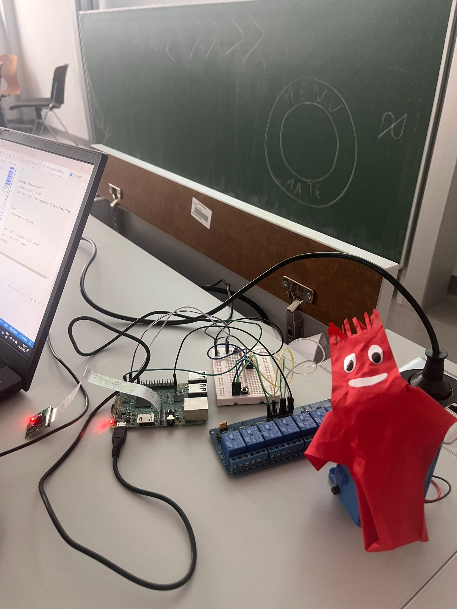
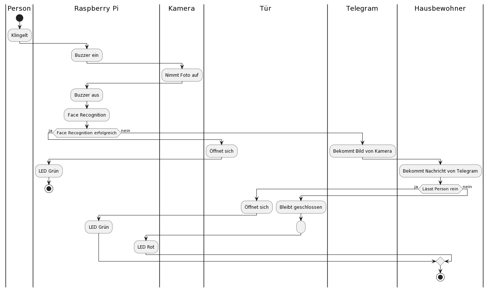
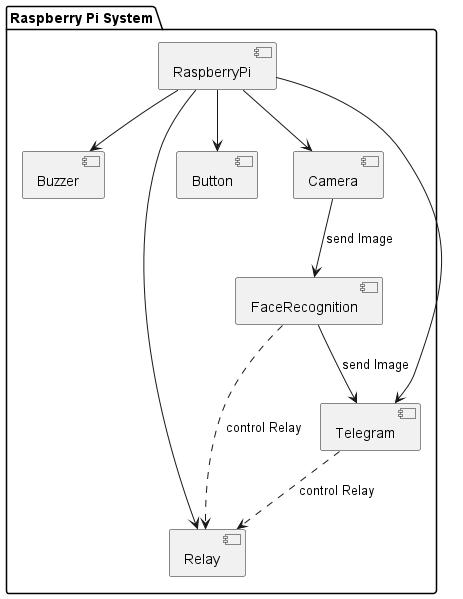
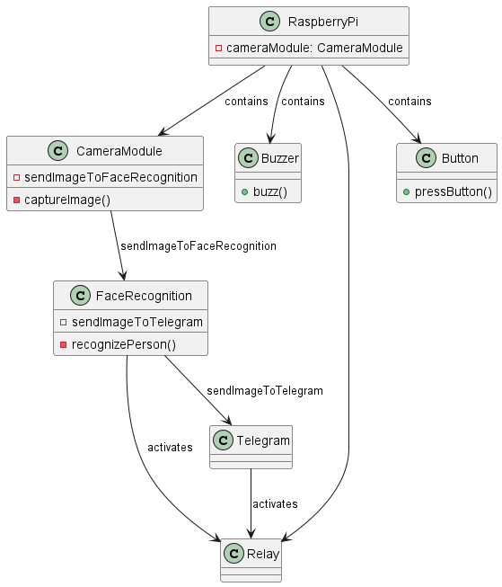
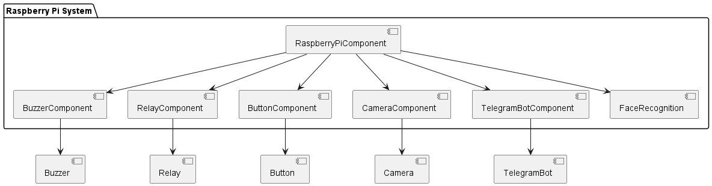
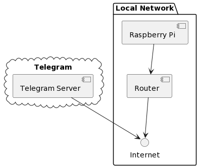

# Team-A

Eine Türklingel soll an einem Haus eingebaut werden. Beim Betätigen eines Knopfes wird ein Foto von einer Kamera aufgenommen und per MQTT an Telegram gesendet. Ein Telegram user kann dann entscheiden, ob die Tür aufgemacht wird oder nicht.

## Dokumentation

### Sprint 1:

#### Adunka:

- Taster an Raspberry Pi anschließen
- Bild der Kamera bei Betätigung der Klingel auf dem Rasperry PI speichern
- Bild wird von dem Raspberry Pi an Telegram geschickt

#### Aichholzer:

- Docker installieren
- HomeAssistant installieren
- Kameramodul anschließen

#### Keuschnig:

- Klassendiagramm
- Komponentendiagramm
- Architekturdiagramm
- Netzwerkdiagramm
- Homeassistant konfigurieren

### Gemeinsam:

- Raspberry Pi flashen
- Funktionsweise eines Relais analysiert
- Relais angeschlossen

### Aufgetretene Probleme:

Wenn HomeAssistant in einem Docker Container läuft, ist es nicht möglich AddOns zu installieren. Daher ist die Anzeige eines Bildes in der Oberfläche nicht möglich. Für dieses Problem ist uns noch keine Lösung bekannt. Daher verwenden wir jetzt Telegram zu anzeigen der Bilder.

### Stand nach Sprint 1:

Wenn man einen Knopf betätigt nimmt der Raspberry Pi ein Foto auf. Dieses Foto wird in einem Verzeichnis abgespeichert. Danach wird das Foto an Telegram geschickt und der Endnutzer empfängt es in einem Chat.

### Sprint 2:

#### Adunka:

- Einbinden des Buzzers als akkustische Klingel
- Ansteuern der LEDs wenn Tür geöffnet wird oder geschlossen bleiben soll
- Ansteuern des Relais wenn die Tür geöffnet werden soll

#### Aichholzer:

- Homeassistant entfernen
- Diagramme überarbeiten
- Sprint Präsentation

#### Keuschnig:

- Buttons zum Öffnen/Geschlossen halten der Tür in Telegram hinzufügen
- Diagramme überarbeiten

### Aufgetretene Probleme:

Diesen Sprint sind keine Probleme aufgetreten.

### Stand nach Sprint 2:

Wenn man einen Knopf betätigt nimmt der Raspberry Pi ein Foto auf. Dieses Foto wird in einem Verzeichnis abgespeichert. Danach wird das Foto an Telegram geschickt und der Endnutzer empfängt es in einem Chat. In der Telegram Nachricht des Bots befinden sich 2 Buttons. Ein Button zum Öffnen der Tür und einen Button um die Tür geschlossen zu halten.

Wenn der Endnutzer sich dazu entscheidet die Tür zu öffnen passiert folgendes:

- Grüne LED wird eingeschalten
- Das Relais wird angesteuert (Simuliert das Öffnen der Tür)
- Grüne LED wird ausgeschalten
- Buttons verschwinden von der Telegram Nachricht um eine erneute Auswahl zu verhindern
- Ursprüngliche Nachricht des Telegram Bots zeigt nun "Opened the door" an

Wenn der Endnutzer sich dazu entscheidet die Tür geschlossen zu halten passiert folgendes:

- Rote LED wird eingeschalten
- 10s Timeout
- Rote LED wird ausgeschalten
- Buttons verschwinden von der Telegram Nachricht um eine erneute Auswahl zu verhindern
- Ursprüngliche Nachricht des Telegram Bots zeigt nun "Did not open the door" an

### Sprint 3:

#### Adunka:

- Gesichtserkennung in Doorbell App einbinden
- Gehäuse Besprechung mit Wernig

#### Aichholzer:

- Dokumentation überarbeiten für Sprint 3
- Gehäuse Besprechung mit Wernig
- Sprint Präsentation

#### Keuschnig:

- Diagramme überarbeiten für Sprint 3
- Gehäuse Besprechung mit Wernig

### Aufgetretene Probleme:

- Langsame Gesichtserkennung

### Stand nach Sprint 3:

Wenn man einen Knopf betätigt nimmt der Raspberry Pi ein Foto auf. Wenn die Gesichtserkennung die Person erkennt wird die Tür geöffnet. Danach wird das Foto an Telegram geschickt und der Endnutzer empfängt es in einem Chat. Wenn die Person von der Gesichtserkennung nicht erkannt wird, befinden sich in der Telegram Nachricht des Bots 2 Buttons. Ein Button zum Öffnen der Tür und einen Button um die Tür geschlossen zu halten.

Wenn die Gesichtserkennung die Person erkennt passiert folgendes:

- Grüne LED wird eingeschalten
- Das Relais wird angesteuert (Simuliert das Öffnen der Tür)
- Grüne LED wird ausgeschalten
- Der Hausbewohner bekommt eine Nachricht mit Bild, welche sagt, dass eine Person herein gelassen wurde

Wenn die Gesichtserkennung die Person nicht erkennt und der Endnutzer sich dazu entscheidet die Tür zu öffnen passiert folgendes:

- Grüne LED wird eingeschalten
- Das Relais wird angesteuert (Simuliert das Öffnen der Tür)
- Grüne LED wird ausgeschalten
- Buttons verschwinden von der Telegram Nachricht um eine erneute Auswahl zu verhindern
- Ursprüngliche Nachricht des Telegram Bots zeigt nun "Opened the door" an

Wenn die Gesichtserkennung die Person nicht erkennt und der Endnutzer sich dazu entscheidet die Tür geschlossen zu halten passiert folgendes:

- Rote LED wird eingeschalten
- 10s Timeout
- Rote LED wird ausgeschalten
- Buttons verschwinden von der Telegram Nachricht um eine erneute Auswahl zu verhindern
- Ursprüngliche Nachricht des Telegram Bots zeigt nun "Did not open the door" an

### Sprint 4:

#### Adunka:

- Fixe IP am Raspberry Pi
- Gesichtserkennungsmodell auslagern
- Video

#### Aichholzer:

- Fixe IP am Raspberry Pi
- Diagramme überarbeiten für Sprint 4
- Dokumentation überarbeiten für Sprint 4
- Präsentation für Sprint 4
- Fritzing Sketch

#### Keuschnig:

- Diagramme überarbeiten für Sprint 4
- Dokumentation überarbeiten für Sprint 4
- Video

### Gemeinsam:

### Aufgetretene Probleme:

- Gehäuse verspätet

### Stand nach Sprint 4:

Vor dem Betrieb der doorbell Applikation muss zuerst das Modell mit einem extra Script mit Bildern trainiert werden. Dieses Modell wird dann auch in einer .pkl Datei abgespeichert.

Beim Start der doorbell Applikation wird zuerst das bereits trainierte Modell reingeladen.

Wenn man dann den Knopf betätigt nimmt der Raspberry Pi ein Foto auf. Wenn die Gesichtserkennung die Person erkennt wird die Tür geöffnet. Danach wird das Foto an Telegram geschickt und der Endnutzer empfängt es in einem Chat. Wenn die Person von der Gesichtserkennung nicht erkannt wird, befinden sich in der Telegram Nachricht des Bots 2 Buttons. Ein Button zum Öffnen der Tür und einen Button um die Tür geschlossen zu halten.

Wenn die Gesichtserkennung die Person erkennt passiert folgendes:

- Grüne LED wird eingeschalten
- Das Relais wird angesteuert (Simuliert das Öffnen der Tür)
- Grüne LED wird ausgeschalten
- Der Hausbewohner bekommt eine Nachricht mit Bild, welche sagt, dass eine Person herein gelassen wurde

Wenn die Gesichtserkennung die Person nicht erkennt und der Endnutzer sich dazu entscheidet die Tür zu öffnen passiert folgendes:

- Grüne LED wird eingeschalten
- Das Relais wird angesteuert (Simuliert das Öffnen der Tür)
- Grüne LED wird ausgeschalten
- Buttons verschwinden von der Telegram Nachricht um eine erneute Auswahl zu verhindern
- Ursprüngliche Nachricht des Telegram Bots zeigt nun "Opened the door" an

Wenn die Gesichtserkennung die Person nicht erkennt und der Endnutzer sich dazu entscheidet die Tür geschlossen zu halten passiert folgendes:

- Rote LED wird eingeschalten
- 10s Timeout
- Rote LED wird ausgeschalten
- Buttons verschwinden von der Telegram Nachricht um eine erneute Auswahl zu verhindern
- Ursprüngliche Nachricht des Telegram Bots zeigt nun "Did not open the door" an

# Aktueller Stand der Diagramme:

Aktivitätsdiagramm:

Architekturdiagramm:

Klassendiagramm:

Komponentendiagramm:

Netzwerkdiagramm:

